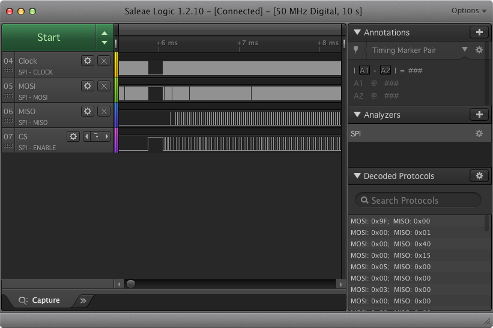
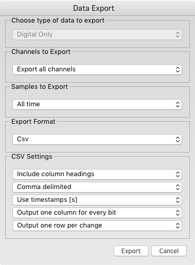

# Salae SPI Packet
Salae's SPI analysis is awesome until you have a huge capture to sort through.

Luckily you can export the capture data into a CSV file.

Once its in a CSV file, you can run this python3 script over it to dump the
start of each packet and filter out commands you aren't interested in.

    python3 spi_packet.py ../Desktop/bad_init.csv

Example output:

    3.298023800000000 READ_DATA            Master 03 00 0d 00 00 00 00 00 Slave 00 00 00 00 00 00 00 00 2080 total bits
    3.300933100000000 PAGE_PROGRAM         Master 02 1f fd 00 00 00 00 00 Slave 00 00 00 00 00 00 00 00 2080 total bits
    3.303866000000000 SECTOR_ERASE         Master 20 00 00 00 Slave 00 00 00 00 32 total bits
    3.303939800000000 READ_DATA            Master 03 1f f0 00 00 00 00 00 Slave 00 00 00 00 00 00 00 00 2080 total bits
    3.306849160000000 PAGE_PROGRAM         Master 02 00 00 00 00 00 00 00 Slave 00 00 00 00 00 00 00 00 2080 total bits
